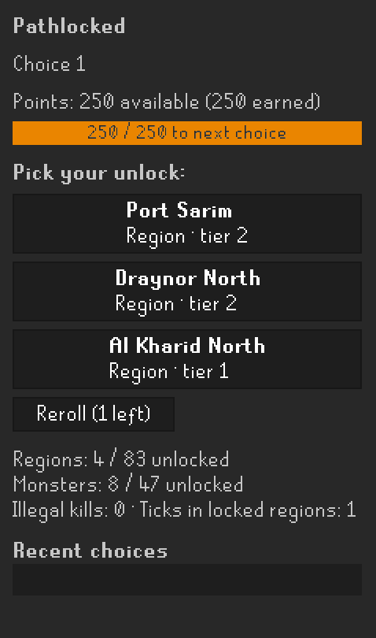
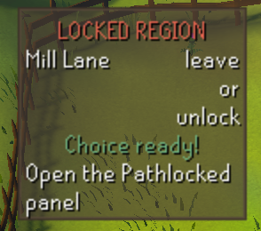
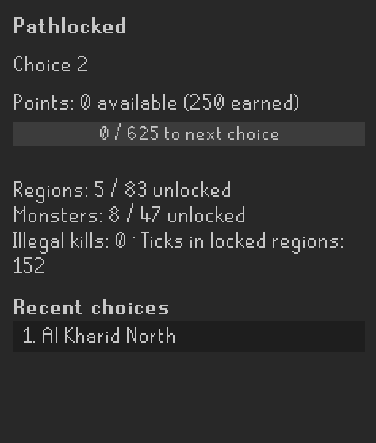
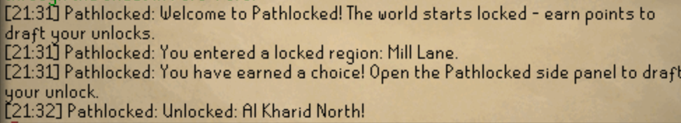

# Pathlocked

**A choice-unlock gamemode for Old School RuneScape.** The world starts locked
apart from a small starter patch — Lumbridge, its swamp and farms, Draynor
Village, and eight low-level creatures to train on. You earn points just by
playing, and when you've banked enough, the game hands you a **draft**: pick
one unlock from the cards on offer. Your account, your route. No two runs look
the same.

Think Bronzeman's restriction meets a roguelite draft: instead of grinding a
fixed path, you *choose* where to expand next, one card at a time.

  

> **v0.1 is an honor-mode, F2P-scoped gamemode.** It shades locked regions,
> deprioritizes (and optionally blocks) attacks on locked monsters, and tracks
> your unlocks — but it does not stop you from walking anywhere or gaining XP
> the client can't gate. The challenge is yours to keep. See the [FAQ](#faq).

---

## Screenshots

| | |
|---|---|
|  |  |
| **The draft** — pick 1 of 3, or reroll once. | **Enforcement** — locked regions warn you on entry. |
|  |  |
| **The panel** — points, next threshold, unlock counts, history. | **Feedback** — every unlock and violation lands in the chat box. |

---

## How it plays

### 1. Earn points

| Source | Rate |
|---|---|
| Non-combat XP | **1 point per 10 XP** (any skill except the combat skills) |
| Killing an **unlocked** listed monster | **points = its combat level** (minimum 1) |

Combat XP is deliberately excluded so kills don't double-count. Skilling XP
counts only on **unlocked ground**, and nothing at all is earned while
trespassing in a **locked** region; kills of unlocked monsters do still pay out
on *uncharted* ground (unmapped dungeons and the like).

### 2. Hit a threshold

Thresholds escalate, so each unlock costs more than the last (base 250,
growth ^1.35, rounded to 25):

| Choice # | Points to unlock |
|---:|---:|
| 1 | 250 |
| 2 | 625 |
| 3 | 1,100 |
| 4 | 1,625 |
| 5 | 2,200 |
| 6 | 2,800 |
| … | … |

The first threshold is banked for new profiles, so you draft immediately on your
first login. When you can afford the next one, a draft opens automatically.

### 3. Draft your unlock

Each draft offers **3 cards — pick 1**, drawn from your **frontier**:

- **Region drafts** offer locked regions **adjacent to** one you already own.
- **Monster drafts** offer locked monsters whose **home region is unlocked**.
- Every **5th** draft is a **free pick** — both categories on the table at
  once, up to 3 regions *and* 3 monsters (six cards).

You get **one reroll** per draft. Offers are **seeded and deterministic** from
your account (or a shared seed), so a reroll is stable across relogs, and two
players on the same seed who make the same picks see the same cards. The
frontier rule guarantees you can never soft-lock: there is always something
reachable to pick.

---

## Configuration

Settings live under **Pathlocked** in the RuneLite config panel.

| Setting | Default | What it does |
|---|---|---|
| **Enforce monster locks** | on | Deprioritizes the *Attack* option on locked monsters so you don't click them by accident. |
| **Hard-block attacks** | on | Goes further: consumes *Attack* clicks on locked monsters entirely (requires the option above). |
| **Shade locked regions** | on | Tints the ground tiles of nearby locked map squares. |
| **Show status overlay** | on | Shows the locked-region warning and the "choice ready" banner. |
| **Seed override** | _(empty)_ | A numeric seed applied only when a **new** profile is created, for shared/seeded runs. Empty = derive the seed from your account. |

---

## FAQ

**Is this an honor-mode challenge?**
Yes, in v0.1. The plugin makes the restrictions *visible and enforceable at the
UI level* — shading, attack-blocking, point gating, and violation tracking — but
it can't physically stop your character from walking into a locked region or
prevent XP the client doesn't surface. It counts violations (trespass ticks,
illegal kills) so you can hold yourself accountable. Treat it like Bronzeman:
the rules only work if you keep them.

**What content is covered?**
v0.1 is scoped to **free-to-play**: 83 regions and 47 monsters, matched by NPC
name (not id). Members areas and unlisted NPCs read as *uncharted* and simply
earn no points rather than being falsely "locked." Dungeons and caves inherit
their surface square's lock status.

**Where is my progress stored?**
Per account, at `~/.runelite/pathlocked/profile-<accountHash>.json` (under your
RuneLite home directory). Each account gets its own profile; nothing is shared
across accounts. Deleting the file resets that account's run.

**Does it work with Bronzeman / Tileman / the OSRS TCG modes?**
It runs alongside them — Pathlocked only reads game events and adjusts menus and
overlays. It layers cleanly on top of restriction modes. The point economy is
modeled on the OSRS TCG (non-combat XP + combat-level kill bounties), so it
feels at home next to those gamemodes.

**Can I share a run with a friend?**
Yes — set the same **Seed override** before either of you creates a profile.
Identical seeds produce identical draft offers for as long as you also make the
same picks: offers are drawn from your unlock frontier, so once your choices
diverge, your cards can too. Great for races played pick-for-pick.

---

## Feedback & issues

Please report bugs and suggestions via the repository's issue tracker. Pathlocked
is provided "as is" as a plugin-hub plugin and is not supported by the RuneLite
developers.

## License

[BSD 2-Clause](LICENSE) © 2026 Hakon Andreas Opdal.
